```mermaid
erDiagram
    USERS ||--o{ THREADS : "user_id"
    USERS ||--o{ POSTS : "user_id"
    USERS ||--o{ THREAD_REACTIONS : "user_id"
    USERS ||--o{ POST_PICTURES : "user_id"
    USERS ||--o{ SESSIONS : "user_id"
    USERS ||--o{ TITLES : "user_id"
    USERS ||--o{ THREAD_VIEWS : "user_id"
    USERS ||--o{ THREAD_LIKES : "user_id"
    USERS ||--o{ THREAD_DISLIKES : "user_id"
    USERS ||--o{ POST_LIKES : "user_id"
    USERS ||--o{ POST_DISLIKES : "user_id"

    THREADS ||--o{ POSTS : "thread_id"
    THREADS ||--o{ THREAD_REACTIONS : "thread_id"
    THREADS ||--o{ THREAD_VIEWS : "thread_id"
    THREADS ||--o{ THREAD_LIKES : "thread_id"
    THREADS ||--o{ THREAD_DISLIKES : "thread_id"

    POSTS ||--o{ POST_PICTURES : "post_id"
    POSTS ||--o{ POST_LIKES : "post_id"
    POSTS ||--o{ POST_DISLIKES : "post_id"

    CATEGORIES ||--o{ THREADS : "category_id"

    USERS {
        integer id PK "Primary Key"
        string uuid "Unique | NOT NULL"
        string name "Unique | NOT NULL"
        string email "Unique | NOT NULL"
        string password "NOT NULL"
        string created_at "NOT NULL | Default CURRENT_TIMESTAMP"
    }

    THREADS {
        integer id PK "Primary Key"
        string uuid "Unique | NOT NULL"
        string topic "NOT NULL"
        string body "NOT NULL"
        integer user_id FK "NOT NULL"
        string created_at "NOT NULL | Default CURRENT_TIMESTAMP"
        integer category_id FK "NOT NULL"
    }

    POSTS {
        integer id PK "Primary Key"
        string uuid "Unique | NOT NULL"
        string body "NOT NULL"
        integer user_id FK "NOT NULL"
        integer thread_id FK "NOT NULL"
        string created_at "NOT NULL | Default CURRENT_TIMESTAMP"
    }

    THREAD_REACTIONS {
        integer id PK "Primary Key"
        string uuid "Unique | NOT NULL"
        integer key "NOT NULL"
        integer seen "NOT NULL | Default 0"
        integer user_id FK "NOT NULL"
        integer thread_id FK "NOT NULL"
    }

    POST_PICTURES {
        integer id PK "Primary Key"
        string uuid "Unique | NOT NULL"
        string name "NOT NULL"
        string path "NOT NULL"
        integer user_id FK "NOT NULL"
        integer post_id FK "NOT NULL"
    }

    CATEGORIES {
        integer id PK "Primary Key"
        string name "Unique | NOT NULL"
    }

    SESSIONS {
        integer id PK "Primary Key"
        string uuid "Unique | NOT NULL"
        string email "Unique | NOT NULL"
        string user_id FK "NOT NULL"
        string created_at "NOT NULL | Default CURRENT_TIMESTAMP"
    }

    TITLES {
        integer id PK "Primary Key"
        integer user_id FK "Unique | NOT NULL"
        integer key "NOT NULL | Default 1"
        string title "NOT NULL | Default 'Pleb'"
    }

    THREAD_VIEWS {
        integer user_id FK "Composite Key | NOT NULL"
        integer thread_id FK "Composite Key | NOT NULL"
    }

    THREAD_LIKES {
        integer id PK "Primary Key"
        integer thread_id FK "NOT NULL"
        integer user_id FK "NOT NULL"
        integer liked "NOT NULL | Default 1"
    }

    THREAD_DISLIKES {
        integer id PK "Primary Key"
        integer thread_id FK "NOT NULL"
        integer user_id FK "NOT NULL"
        integer disliked "NOT NULL | Default 1"
    }

    POST_LIKES {
        integer id PK "Primary Key"
        integer post_id FK "NOT NULL"
        integer user_id FK "NOT NULL"
        integer liked "NOT NULL | Default 1"
    }

    POST_DISLIKES {
        integer id PK "Primary Key"
        integer post_id FK "NOT NULL"
        integer user_id FK "NOT NULL"
        integer disliked "NOT NULL | Default 1"
    }
```

# Database Schema for Literary Lions Forum

This diagram represents the Entity-Relationship Diagram (ERD) for the Literary Lions Forum project database.

ERD Diagram can be easily viewed by installing the Markdown Preview Mermaid Support extension if viewing in VSCode

ERD made using [Mermaid](https://mermaid.js.org/syntax/entityRelationshipDiagram.html).
## Can also be viewed via :
```
localhost:8080/view-erd
```
